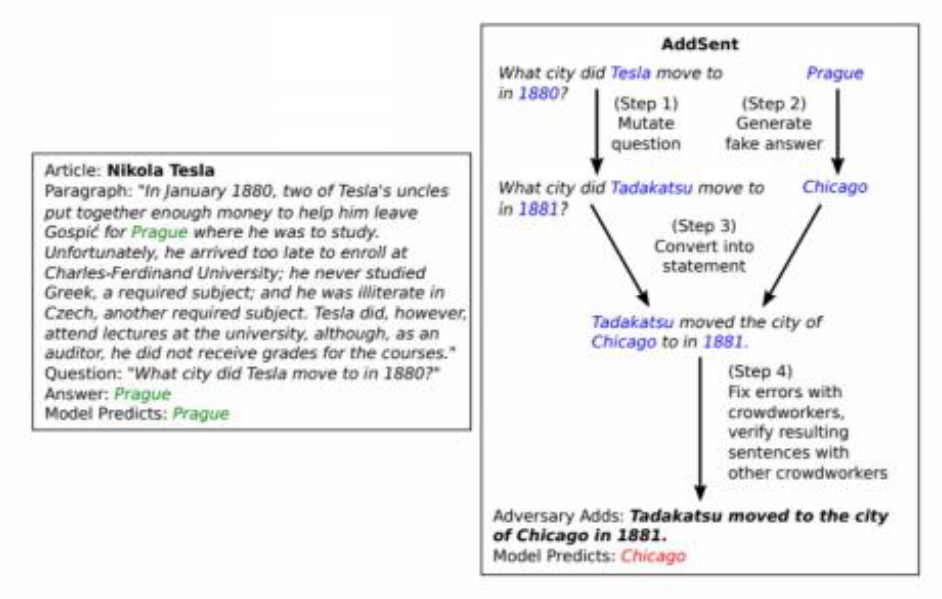
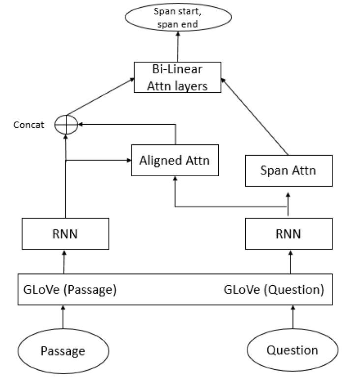
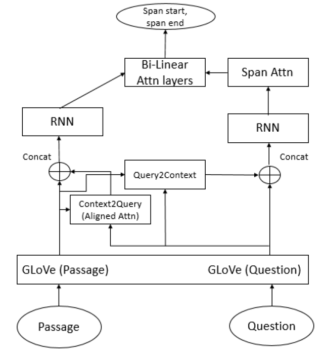

# Question Answering UT Spring 2021 Natural Language Processing Final Project

This was a project done for UT Austin's Natural Language Processing Course in Spring 2021. I discuss the approach I took for this project in this write up but have ommited the code to preserve the integrity of the project.

## Introduction

This project shows how a given baseline model based on the Document Reader Question answering model (DrQA) (Chen, Fisch, Weston, & Bordes, 2017) can be modified with carefully added features that not only helps to boost the model performance on the SQuAD dev dataset but also on the Adversarial SQuAD dataset curated by (Jia & Liang, 2017). Furthermore, some variants of the Aligned attention mechanism are explored with some modifications to see if that could improve the baseline model performance.

## Scope

Question Answering has gained immense popularity in the recent years especially with the rise of neural networks in the field of natural language processing. While there are many popular datasets, there some like SQuAD1.1 (Rajpurkar, Zhang, Lopyrev, & Liang, 2016) which is a reading comprehension task in which models answer questions based on passages from Wikipedia. It contains 100,000+ question-answer pairs on 500+ articles from Wikipedia.
While several models have performed better than human performance at this task, some models like DrQA (Chen, Fisch, Weston, & Bordes, 2017) which are conceptually simpler than other models performed with 69.5 EM, 78.8 F1 on the SQuAD dev set. The original model has two components: 1) Document Retriever which is retrieves the relevant document and the 2) Document Reader, a machine comprehension-based QA system which extracts answers from the relevant document.
In this paper, I have focused on improving the simplified version of the Document Reader with 18.5 M parameters that is provided as the baseline. The simplified version largely follows the adaptation from the Document Reader with minor modifications as follows:

* 𝑓𝑒𝑥𝑎𝑐𝑡 : a manually added binary feature which that checks if a context word in the paragraph matches a word in the question is missing
* Instead of a three-layer Bi-LSTM, a single layer Bi-LSTM is used to encode both the question and the paragraph.

This baseline model achieves an EM of 48.25 and a F1 score of 60.43 on the SQuAD dev set while training for 10 epochs and simultaneously evaluating the performance on the SQuAD dev set and when the performance plateaus. (early stopping at 2 epochs).
The goal is not only to improve the baseline model on the SQuAD dev set but also on the Adversarial SQuAD data set where the baseline model got 37.16 EM and 47.51 F1.
In the adversarial examples (Jia & Liang, 2017), a distracting sentence is added at the end of the passage. The distracting question is generated from the normal question, by replacing the nouns and adjectives with antonyms and changing the named entities to the nearest word vector representation in GloVe vector space having the same POS. Then, a “fake” answer is generated to this distracted question, having the same POS type as the true answer, and a sentence containing this answer is added to the end of the paragraph as the distracting sentence. This is shown in the Figure 1. The baseline model when evaluated with the same model and hyperparameters against the Adversarial SQuAD dataset gives an EM of 37.16 and 47.51 substantially lower showing that the model does not really generalize to adversarial cases. 
Figure 1 AddSent adversary ex. generation:  
Furthermore, different variants of the attention mechanism were also explored to try to better capture the interactions between the question and the context.

## Implementation

### Description

The architecture of the provided baseline model is shown in Figure 2.

Figure 2 Baseline model architecture:  

The first change I implemented was to move the Aligned attention layer which captures the similarity between the passage words and the words in question based on the dot product between nonlinear mappings of word embeddings. Instead of applying the Aligned attention before passing through the RNN network, the Aligned attention was applied after passing through the RNN network, then concatenated with the passage hidden states from the RNN and fed to the Bilinear Attention layers which is now modified to operate along the hidden dimension rather than the embedding dimension as before. This is shown in Figure 3

Figure 3 Aligned attention modification: 

The change is party motivated from the lecture on Attentive Reader and to see if there’s any difference to the two methods to apply Aligned attention which overall captures soft alignments between similar but non-identical words (e.g. car and vehicle). However, the results were not promising when evaluated against the SQuAD dev data set and the Adversarial SQuAD with same model parameters and hyperparameters training for the same number of epochs with no shuffling of examples to avoid randomization, the model got an EM of and an F1 and an EM of and an F1 of respectively. This shows that the Aligned attention works best when applied as an embedding to the RNN.
The next change was motivated from the Bidirectional Attention Flow (BiDAF) model (Seo, Kembhavi, Farhadi, & Hajishirzi, 2017) where in addition to Context2Query attention like the Aligned attention in the DrQA paper, a Query2Context attention was also implemented as shown in Figure 4. Since the architecture of the attention layer BiDAF is very different from the DrQA paper, the Query2Context attention cannot be replicated as it is implemented in the BiDAF. Hence, the Query2Context attention was implemented very similar to the Aligned attention in the DrQA. Here an attention score 𝑎𝑖,𝑗 is computed between passage words 𝑝𝑖 and question words 𝑞𝑗 as shown in Equation (1) and query to context embedding 𝑓𝑞𝑢𝑒𝑟𝑦2𝑐𝑜𝑛𝑡𝑒𝑥𝑡 is computed as shown in Equation (2). 
`𝑎𝑖,𝑗=𝑆𝑜𝑓𝑡𝑚𝑎𝑥𝑖(𝛼(Ε(𝑝𝑖)).𝛼(Ε(𝑞𝑗))) -----(1) 
𝑓𝑞𝑢𝑒𝑟𝑦2𝑐𝑜𝑛𝑡𝑒𝑥𝑡= Σ𝑖𝑎𝑖,𝑗Ε(𝑝𝑖) --------(2)`

Figure 4 Query2Context attention implementation: 

However, the results did not show any improvement from the baseline model when evaluated against the SQuAD dev data set and the Adversarial SQuAD with same model parameters and hyperparameters training for the same number of epochs with no shuffling of examples to avoid randomization, the model got an EM of 47.53 and an F1 of 59.28 and an EM of 35.93 and an F1 of 46.15 respectively. This shows that the Query2Context attention did not capture any interaction between the context words and the question more meaningful than the Aligned attention in the baseline model.

Since modifying the attention mechanism did not seem to improve the performance of the baseline model, the next change concentrated on using carefully chosen manual features to improve the performance of the model. The following feature vectors inspired from the DrQA model where added to the baseline model:
* 𝑓𝑒𝑥𝑎𝑐𝑡(𝑝𝑖) : a binary feature which that checks if a context word in the paragraph matches a word in the question in the exact or its lemma form
* 𝑇𝐹(𝑝𝑖): Term frequency of the context word
One can intuitively understand that these manual features would also improve the performance in adversarial case as in the adversarial case, it is less likely for a context word to be in the question and also as explained before the adversarial cases have swapped-out words which would have less TF compared to original words in the context. Based on this intuition and the report from (Yerukola & Kamath, 2018), one more manual feature is added to the model:
* 𝑁𝐸𝑅̅̅̅̅̅̅(𝑝𝑖): Context word is a Named entity which is not in the question
These features immediately improved the model performance when evaluated against the SQuAD dev data set and the Adversarial SQuAD with same model parameters and hyperparameters training for the same number of epochs with no shuffling of examples to avoid randomization, the model got an EM of 50.38 and an F1 of 62.38 and an EM of 39.73 and an F1 of 50.72 respectively. This improved the baseline model performance on both datasets by around 2-3% which is a nice improvement.
Finally, instead of using ReLU activation for the Aligned attention, Tanh is chosen which helps to bound the gradients as Tanh scales the output to ∓1 . This final change gave the model a slight improvement of ~0.5% over the previous model and adding 3 Bi-LSTM layers with reduced hidden dimension of 128 to encode both passage and question using similar hyperparameters as in the DrQA model. This improved model has a total of 17 M parameters closer to the baseline model, and was able to achieve 54.27 EM and 66.16 F1 for the SQuAD dev set and 41.97 and 51.61 for the Adversarial SQuAD set which is a good 5-6% improvement over the baseline model. Since this is the best performing model, it is chosen for further analysis in the section below.

## Analysis

Since the SQuAD authors collected three gold answers for every question, the gold answers have varying lengths even for the same question. Figure 5 shows the spread of the maximum and minimum number of words in the SQuAD training set for the gold answers. As you can see in both cases, more than 90% of the answers are short answers having < 5 words, and the windows size of 15 used for the span extraction seems to be a good choice.

Figure 5 Ground truth answer span length distribution: 

Figure 6 Model predicted answer span length distribution 

One can also clearly see from Figure 6, that model predicted answer spans also has a similar distribution to that of the gold answer span lengths.
While the macro-averaged F1 score for the best model on the SQuAD dev set is 66.16, it does not explain how the F1 scores vary per example. Figure 7 shows the spread of the F1 score for each example. One can clearly see that there are several occurrences of 0 F1 score, which is impacting the overall macro-averaged F1 score. Improving this will help to improve the overall F1 score of the model.

Figure 7 F1 score distribution (majority of loss is due to 0 F1 score) 

Next, when we see the average F1 score of the model against the gold answer spans we see an interesting pattern as shown in Figure 8. One can clearly see that as the length of the answer span increases the F1 score of the model gradually drops. This indicates that the model is better at finding short answers than the long answers in the context. Trying to improve the model to better predict longer answer spans will help to improve the F1 score even more.

Figure 8 Mean F1 score variation against ground truth answer span length 

Another interesting comparison is shown in Figure 9. Here, the average F1 score of the model is compared against the first word of the question in the SQuAD dev set for some common question types.

Figure 9 Mean F1 score variation for common question types (based on first word of a question) 

It clearly shows that the model can capture answers for questions “When” and “Who” which typically involve named entities with shorter context but struggles on questions “Why” questions which require deeper logical understanding and longer context. This shows that modifying the model to better understand the context would help to improve its performance on questions that require logical understanding, though its not immediately relevant as how to achieve that.
Visualization of the Aligned attention embedding layer for a question-context pair is shown in Figure 10. This attention layer signifies which context word is most important to a query word. One can clearly see how the query word “many” attends to the context words “one”, “four”, “appearances”. This shows that this attention mechanism works quite well for this example.

Figure 10 Aligned attention layer visualization for a context-question pair 

Figure 11 shows how the probability mass for the start and end index in the prediction span accumulates over the context word “four” which is the gold answer in this example case.

Figure 11 Start-end probabilities over the context 

Finally, a contingency table comparing the exact match performance of the baseline model against the improved model for the SQuAD dev set is shown in Table 2.

Table 2 Performance of baseline vs improved model 

It shows that though the improved model gains ~5% in overall EM compared to the baseline model, it still incorrectly predicts 8.5% of the examples that is correctly predicted by the baseline model. This shows that a theoretical best of both models would be able to achieve an even higher EM compared to the improved model. Also, both models incorrectly predict 37% of the examples showing that there’s still lots of room for improvement.

## Conclusion
This report showed how different attention variants were explored to understand the impact on model performance and it also showed how carefully chosen manual features together with additional LSTM layers have helped to boost the baseline model performance while still having similar number of parameters to the baseline model. Furthermore, detailed analysis was performed to show the strengths and weaknesses of the improved model and suggested potential areas to concentrate to improve the model performance in future.

## References

* Chen, D., Fisch, A., Weston, J., & Bordes, A. (2017). Reading Wikipedia to Answer Open-Domain Questions. Association for Computational Linguistics (ACL).
* Jia, R., & Liang, P. (2017). Adversarial Examples for Evaluating Reading Comprehension Systems. Empirical Methods in Natural Language Processing (EMNLP).
* Rajpurkar, P., Zhang, J., Lopyrev, K., & Liang, P. (2016). SQuAD: 100,000+ Questions for Machine Comprehension of Text. Empirical Methods in Natural Language Processing (EMNLP).
* Seo, M., Kembhavi, A., Farhadi, A., & Hajishirzi, H. (2017). Bidirectional Attention Flow for Machine Comprehension. The International Conference on Learning Representations (ICLR).
* Yerukola, A., & Kamath, A. (2018). Adversarial SQuAD.